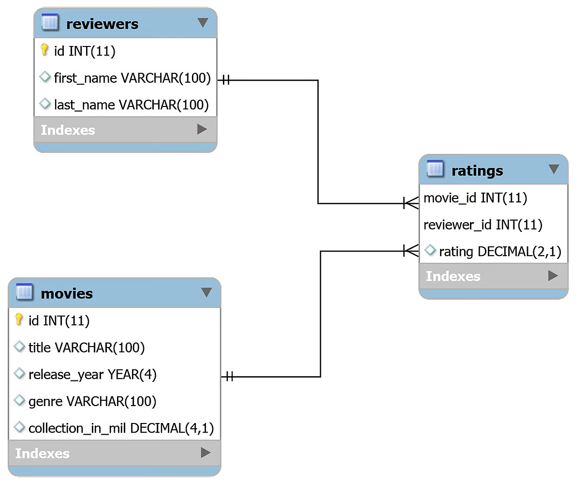

# Python and MySQL Database: A Practical Introduction

MySQL is one of the most popular database management systems (DBMSs) on the market today. It ranked second only to the Oracle DBMS in this year’s DB-Engines Ranking. As most software applications need to interact with data in some form, programming languages like Python provide tools for storing and accessing these data sources.

Using the techniques discussed in this tutorial, you’ll be able to efficiently integrate a MySQL database with a Python application. You’ll develop a small MySQL database for a movie rating system and learn how to query it directly from your Python code.

## Installing MySQL Connector/Python

A database driver is a piece of software that allows an application to connect and interact with a database system. Programming languages like Python need a special driver before they can speak to a database from a specific vendor.

These drivers are typically obtained as third-party modules. The Python Database API (DB-API) defines the standard interface with which all Python database drivers must comply. These details are documented in PEP 249. All Python database drivers, such as sqlite3 for SQLite, psycopg for PostgreSQL, and MySQL Connector/Python for MySQL, follow these implementation rules.

> Note: MySQL’s official documentation uses the term connector instead of driver. Technically, connectors are associated only with connecting to a database, not interacting with it. However, the term is often used for the entire database access module comprising the connector and the driver.
>
>To maintain consistency with the documentation, you’ll see the term connector whenever MySQL is mentioned.

Many popular programming languages have their own database API. For example, Java has the Java Database Connectivity (JDBC) API. If you need to connect a Java application to a MySQL database, then you need to use the MySQL JDBC connector, which follows the JDBC API.

Similarly, in Python you need to install a Python MySQL connector to interact with a MySQL database. Many packages follow the DB-API standards, but the most popular among them is MySQL Connector/Python. You can get it with pip:

```sh
$ pip install mysql-connector-python
```

pip installs the connector as a third-party module in the currently active virtual environment. It’s recommended that you set up an isolated virtual environment for the project along with all the dependencies.

To test if the installation was successful, type the following command on your Python terminal:

```py
>>> import mysql.connector
```

If the above code executes with no errors, then mysql.connector is installed and ready to use. If you encounter any errors, then make sure you’re in the correct virtual environment and you’re using the right Python interpreter.

Make sure that you’re installing the correct mysql-connector-python package, which is a pure-Python implementation. Beware of similarly named but now depreciated connectors like mysql-connector.

## Establishing a Connection With MySQL Server
MySQL is a server-based database management system. One server might contain multiple databases. To interact with a database, you must first establish a connection with the server. The general workflow of a Python program that interacts with a MySQL-based database is as follows:
1. Connect to the MySQL server.
1. Create a new database.
1. Connect to the newly created or an existing database.
1. Execute a SQL query and fetch results.
1. Inform the database if any changes are made to a table.
1. Close the connection to the MySQL server.

This is a generic workflow that might vary depending on the individual application. But whatever the application might be, the first step is to connect your database with your application.

### Establishing a Connection
The first step in interacting with a MySQL server is to establish a connection. To do this, you need connect() from the mysql.connector module. This function takes in parameters like host, user, and password and returns a MySQLConnection object. You can receive these credentials as input from the user and pass them to connect():

```py
from getpass import getpass
from mysql.connector import connect, Error

try:
    with connect(
        host="localhost",
        user=input("Enter username: "),
        password=getpass("Enter password: "),
    ) as connection:
        print(connection)
except Error as e:
    print(e)
```

The code above uses the entered login credentials to establish a connection with your MySQL server. In return, you get a MySQLConnection object, which is stored in the connection variable. From now on, you’ll use this variable to access your MySQL server.

There are several important things to notice in the code above:

1. You should always deal with the exceptions that might be raised while establishing a connection to the MySQL server. This is why you use a try … except block to catch and print any exceptions that you might encounter.
 
1. You should always close the connection after you’re done accessing the database. Leaving unused open connections can lead to several unexpected errors and performance issues. The above code takes advantage of a context manager using with, which abstracts away the connection cleanup process.
1
1. You should never hard-code your login credentials, that is, your username and password, directly in a Python script. This is a bad practice for deployment and poses a serious security threat. The code above prompts the user for login credentials. It uses the built-in getpass module to hide the password. While this is better than hard-coding, there are other, more secure ways to store sensitive information, like using environment variables.

You’ve now established a connection between your program and your MySQL server, but you still need to either create a new database or connect to an existing database inside the server.

### Creating a New Database
In the last section, you established a connection with your MySQL server. To create a new database, you need to execute a SQL statement:

```sql
CREATE DATABASE books_db;
```

The above statement will create a new database with the name books_db.

> Note: In MySQL, it’s mandatory to put a semicolon (;) at the end of a statement, which denotes the termination of a query. However, MySQL Connector/Python automatically appends a semicolon at the end of your queries, so there’s no need to use it in your Python code.

To execute a SQL query in Python, you’ll need to use a cursor, which abstracts away the access to database records. MySQL Connector/Python provides you with the MySQLCursor class, which instantiates objects that can execute MySQL queries in Python. An instance of the MySQLCursor class is also called a cursor.

cursor objects make use of a MySQLConnection object to interact with your MySQL server. To create a cursor, use the .cursor() method of your connection variable:

```py
cursor = connection.cursor()
```

The above code gives you an instance of the MySQLCursor class.

A query that needs to be executed is sent to cursor.execute() in string format. In this particular occasion, you’ll send the CREATE DATABASE query to cursor.execute():

```py
from getpass import getpass
from mysql.connector import connect, Error

try:
    with connect(
        host="localhost",
        user=input("Enter username: "),
        password=getpass("Enter password: "),
    ) as connection:
        create_db_query = "CREATE DATABASE online_movie_rating"
        with connection.cursor() as cursor:
            cursor.execute(create_db_query)
except Error as e:
    print(e)
```

After executing of the code above, you’ll have a new database called online_movie_rating in your MySQL server.

The CREATE DATABASE query is stored as a string in the create_db_query variable and then passed to cursor.execute() for execution. The code uses a context manager with the cursor object to handle the cleanup process.

You might receive an error here if a database with the same name already exists in your server. To confirm this, you can display the name of all databases in your server. Using the same MySQLConnection object from earlier, execute the SHOW DATABASES statement:

```py
>>> show_db_query = "SHOW DATABASES"
>>> with connection.cursor() as cursor:
...     cursor.execute(show_db_query)
...     for db in cursor:
...         print(db)
...
('information_schema',)
('mysql',)
('online_movie_rating',)
('performance_schema',)
('sys',)
```

The above code prints the names of all the databases currently in your MySQL server. The SHOW DATABASES command also outputs some databases that you didn’t create in your server, like information_schema, performance_schema, and so on. These databases are generated automatically by the MySQL server and provide access to a variety of database metadata and MySQL server settings.

You created a new database in this section by executing the CREATE DATABASE statement. In the next section, you’ll see how to connect to a database that already exists.

### Connecting to an Existing Database
In the last section, you created a new database called online_movie_rating. However, you still haven’t connected to it. In many situations, you’ll already have a MySQL database that you want to connect with your Python application.

You can do this using the same connect() function that you used earlier by sending an additional parameter called database:

```py
from getpass import getpass
from mysql.connector import connect, Error

try:
    with connect(
        host="localhost",
        user=input("Enter username: "),
        password=getpass("Enter password: "),
        database="online_movie_rating",
    ) as connection:
        print(connection)
except Error as e:
    print(e)
```

The above code is very similar to the connection script that you used earlier. The only change here is an additional database parameter, where the name of your database is passed to connect(). Once you execute this script, you’ll be connected to the online_movie_rating database.

## Creating, Altering, and Dropping a Table

In this section, you’ll learn how to perform some basic DDL queries like CREATE, DROP, and ALTER with Python. You’ll get a quick look at the MySQL database that you’ll use in the rest of this tutorial. You’ll also create all the tables required for the database and learn how to perform modifications on these tables later on.

### Defining the Database Schema
You can start by creating a database schema for an online movie rating system. The database will consist of three tables:

1. movies contains general information about movies and has the following attributes:
    - id
    - title
    - release_year
    - genre
collection_in_mil
2. reviewers contains information about people who posted reviews or ratings and has the following attributes:
    - id
    - first_name
    - last_name
3. ratings contains information about ratings that have been posted and has the following attributes:
    - movie_id (foreign key)
    - reviewer_id (foreign key)
    - rating

A real-world movie rating system, like IMDb, would need to store a bunch of other attributes, like emails, movie cast lists, and so on. If you want, you can add more tables and attributes to this database. But these three tables will suffice for the purpose of this tutorial.

The image below depicts the database schema:

 Schema Diagram for an Online Movie Rating System

The tables in this database are related to each other. movies and reviewers will have a many-to-many relationship since one movie can be reviewed by multiple reviewers and one reviewer can review multiple movies. The ratings table connects the movies table with the reviewers table.

### Creating Tables Using the CREATE TABLE Statement

Now, to create a new table in MySQL, you need to use the CREATE TABLE statement. The following MySQL query will create the movies table for your online_movie_rating database:

```sql
CREATE TABLE movies(
    id INT AUTO_INCREMENT PRIMARY KEY,
    title VARCHAR(100),
    release_year YEAR(4),
    genre VARCHAR(100),
    collection_in_mil INT
);
```

If you’ve looked at SQL statements before, then most of the above query might make sense. But there are some differences in the MySQL syntax that you should be aware of.

For example, MySQL has a wide variety of data types for your perusal, including YEAR, INT, BIGINT, and so on. Also, MySQL uses the AUTO_INCREMENT keyword when a column value has to be incremented automatically on the insertion of new records.

To create a new table, you need to pass this query to cursor.execute(), which accepts a MySQL query and executes the query on the connected MySQL database:

```py
create_movies_table_query = """
CREATE TABLE movies(
    id INT AUTO_INCREMENT PRIMARY KEY,
    title VARCHAR(100),
    release_year YEAR(4),
    genre VARCHAR(100),
    collection_in_mil INT
)
"""
with connection.cursor() as cursor:
    cursor.execute(create_movies_table_query)
    connection.commit()
```

Now you have the movies table in your database. You pass create_movies_table_query to cursor.execute(), which performs the required execution.

> Note: The connection variable refers to the MySQLConnection object that was returned when you connected to your database.

Also, notice the connection.commit() statement at the end of the code. By default, your MySQL connector doesn’t autocommit transactions. In MySQL, modifications mentioned in a transaction occur only when you use a COMMIT command in the end. Always call this method after every transaction to perform changes in the actual table.

As you did with the movies table, execute the following script to create the reviewers table:

```py
create_reviewers_table_query = """
CREATE TABLE reviewers (
    id INT AUTO_INCREMENT PRIMARY KEY,
    first_name VARCHAR(100),
    last_name VARCHAR(100)
)
"""
with connection.cursor() as cursor:
    cursor.execute(create_reviewers_table_query)
    connection.commit()
```

If required, you could add more information about a reviewer, such as their email ID or demographic information. But first_name and last_name will serve your purpose for now.

Finally, you can create the ratings table using the following script:

```py
create_ratings_table_query = """
CREATE TABLE ratings (
    movie_id INT,
    reviewer_id INT,
    rating DECIMAL(2,1),
    FOREIGN KEY(movie_id) REFERENCES movies(id),
    FOREIGN KEY(reviewer_id) REFERENCES reviewers(id),
    PRIMARY KEY(movie_id, reviewer_id)
)
"""
with connection.cursor() as cursor:
    cursor.execute(create_ratings_table_query)
    connection.commit()
```

The implementation of foreign key relationships in MySQL is slightly different and limited as compared to the standard SQL. In MySQL, both the parent and the child in the foreign key constraint must use the same storage engine.

A storage engine is the underlying software component that a database management system uses for performing SQL operations. In MySQL, storage engines come in two different flavors:

1. Transactional storage engines are transaction safe and allow you to roll back transactions using simple commands like rollback. Many popular MySQL engines, including InnoDB and NDB, belong to this category.

2. Nontransactional storage engines depend on elaborate manual code to undo statements committed on a database. MyISAM, MEMORY, and many other MySQL engines are nontransactional.


InnoDB is the default and most popular storage engine. It helps maintain data integrity by supporting foreign key constraints. This means that any CRUD operation on a foreign key is checked to ensure that it doesn’t lead to inconsistencies across different tables.

Also, note that the ratings table uses the columns movie_id and reviewer_id, both foreign keys, jointly as the primary key. This step ensures that a reviewer can’t rate the same movie twice.

You may choose to reuse the same cursor for multiple executions. In that case, all executions would become one atomic transaction rather than multiple separate transactions. For example, you can execute all CREATE TABLE statements with one cursor and then commit your transaction only once:

```py
with connection.cursor() as cursor:
    cursor.execute(create_movies_table_query)
    cursor.execute(create_reviewers_table_query)
    cursor.execute(create_ratings_table_query)
    connection.commit()
```

The above code will first execute all three CREATE statements. Then it will send a COMMIT command to the MySQL server that commits your transaction. You can also use .rollback() to send a ROLLBACK command to the MySQL server and remove all data changes from the transaction.

### Showing a Table Schema Using the DESCRIBE Statement

Now, that you’ve created all three tables, you can look at their schema using the following SQL statement:

```sql
DESCRIBE <table_name>;
```

To get some results back from the cursor object, you need to use cursor.fetchall(). This method fetches all rows from the last executed statement. Assuming you already have the MySQLConnection object in the connection variable, you can print out all the results fetched by cursor.fetchall():

```py
>>> show_table_query = "DESCRIBE movies"
>>> with connection.cursor() as cursor:
...     cursor.execute(show_table_query)
...     # Fetch rows from last executed query
...     result = cursor.fetchall()
...     for row in result:
...         print(row)
...
('id', 'int(11)', 'NO', 'PRI', None, 'auto_increment')
('title', 'varchar(100)', 'YES', '', None, '')
('release_year', 'year(4)', 'YES', '', None, '')
('genre', 'varchar(100)', 'YES', '', None, '')
('collection_in_mil', 'int(11)', 'YES', '', None, '')
```

Once you execute the above code, you should receive a table containing information about all the columns in movies table. For each column, you’ll receive details like the column’s data type, whether the column is a primary key, and so on.

### Modifying a Table Schema Using the ALTER Statement

In the movies table, you have a column called collection_in_mil, which contains a movie’s box office collection in millions of dollars. You can write the following MySQL statement to modify the data type of collection_in_mil attribute from INT to DECIMAL:

```sql
ALTER TABLE movies MODIFY COLUMN collection_in_mil DECIMAL(4,1);
```

DECIMAL(4,1) means a decimal number that can have a maximum of 4 digits, of which 1 is decimal, such as 120.1, 3.4, 38.0, and so on. After executing the ALTER TABLE statement, you can show the updated table schema using DESCRIBE:

```py
>>> alter_table_query = """
... ALTER TABLE movies
... MODIFY COLUMN collection_in_mil DECIMAL(4,1)
... """
>>> show_table_query = "DESCRIBE movies"
>>> with connection.cursor() as cursor:
...     cursor.execute(alter_table_query)
...     cursor.execute(show_table_query)
...     # Fetch rows from last executed query
...     result = cursor.fetchall()
...     print("Movie Table Schema after alteration:")
...     for row in result:
...         print(row)
...
Movie Table Schema after alteration
('id', 'int(11)', 'NO', 'PRI', None, 'auto_increment')
('title', 'varchar(100)', 'YES', '', None, '')
('release_year', 'year(4)', 'YES', '', None, '')
('genre', 'varchar(100)', 'YES', '', None, '')
('collection_in_mil', 'decimal(4,1)', 'YES', '', None, '')
```

As shown in the output, the collection_in_mil attribute is now of type DECIMAL(4,1). Also note that in the code above, you call cursor.execute() twice. But cursor.fetchall() fetches rows from only the last executed query, which is the show_table_query.

### Deleting Tables Using the DROP Statement

To delete a table, you need to execute the DROP TABLE statement in MySQL. Deleting a table is an irreversible process. If you execute the code below, then you’ll need to call the CREATE TABLE query again to use the ratings table in the upcoming sections.

To delete the ratings table, send drop_table_query to cursor.execute():

```py
drop_table_query = "DROP TABLE ratings"
with connection.cursor() as cursor:
    cursor.execute(drop_table_query)
```
If you execute the above code, you will have successfully deleted the ratings table.


## Inserting Records in Tables
In the last section, you created three tables in your database: movies, reviewers, and ratings. Now you need to populate these tables with data. This section will cover two different ways to insert records in the MySQL Connector for Python.

The first method, .execute(), works well when the number of records is small and the records can be hard-coded. The second method, .executemany(), is more popular and is better suited for real-world scenarios.

### Using .execute()

The first approach uses the same cursor.execute() method that you’ve been using until now. You write the INSERT INTO query in a string and pass it to cursor.execute(). You can use this method to insert data into the movies table.

For reference, the movies table has five attributes:
1. id
1. title
1. release_year
1. genre
1. collection_in_mil

You don’t need to add data for id as the AUTO_INCREMENT automatically calculates id for you. The following script inserts records into the movies table:
```py
insert_movies_query = """
INSERT INTO movies (title, release_year, genre, collection_in_mil)
VALUES
    ("Forrest Gump", 1994, "Drama", 330.2),
    ("3 Idiots", 2009, "Drama", 2.4),
    ("Eternal Sunshine of the Spotless Mind", 2004, "Drama", 34.5),
    ("Good Will Hunting", 1997, "Drama", 138.1),
    ("Skyfall", 2012, "Action", 304.6),
    ("Gladiator", 2000, "Action", 188.7),
    ("Black", 2005, "Drama", 3.0),
    ("Titanic", 1997, "Romance", 659.2),
    ("The Shawshank Redemption", 1994, "Drama",28.4),
    ("Udaan", 2010, "Drama", 1.5),
    ("Home Alone", 1990, "Comedy", 286.9),
    ("Casablanca", 1942, "Romance", 1.0),
    ("Avengers: Endgame", 2019, "Action", 858.8),
    ("Night of the Living Dead", 1968, "Horror", 2.5),
    ("The Godfather", 1972, "Crime", 135.6),
    ("Haider", 2014, "Action", 4.2),
    ("Inception", 2010, "Adventure", 293.7),
    ("Evil", 2003, "Horror", 1.3),
    ("Toy Story 4", 2019, "Animation", 434.9),
    ("Air Force One", 1997, "Drama", 138.1),
    ("The Dark Knight", 2008, "Action",535.4),
    ("Bhaag Milkha Bhaag", 2013, "Sport", 4.1),
    ("The Lion King", 1994, "Animation", 423.6),
    ("Pulp Fiction", 1994, "Crime", 108.8),
    ("Kai Po Che", 2013, "Sport", 6.0),
    ("Beasts of No Nation", 2015, "War", 1.4),
    ("Andadhun", 2018, "Thriller", 2.9),
    ("The Silence of the Lambs", 1991, "Crime", 68.2),
    ("Deadpool", 2016, "Action", 363.6),
    ("Drishyam", 2015, "Mystery", 3.0)
"""
with connection.cursor() as cursor:
    cursor.execute(insert_movies_query)
    connection.commit()
```

The movies table is now loaded with thirty records. The code calls connection.commit() at the end. It’s crucial to call .commit() after preforming any modifications to a table.

### Using .executemany()
The previous approach is more suitable when the number of records is fairly small and you can write these records directly into the code. But this is rarely true. You’ll often have this data stored in some other file, or the data will be generated by a different script and will need to be added to the MySQL database.

This is where .executemany() comes in handy. It accepts two parameters:

1. A query that contains placeholders for the records that need to be inserted
2. A list that contains all records that you wish to insert

The following example inserts records for the reviewers table:

```py
insert_reviewers_query = """
INSERT INTO reviewers
(first_name, last_name)
VALUES ( %s, %s )
"""
reviewers_records = [
    ("Chaitanya", "Baweja"),
    ("Mary", "Cooper"),
    ("John", "Wayne"),
    ("Thomas", "Stoneman"),
    ("Penny", "Hofstadter"),
    ("Mitchell", "Marsh"),
    ("Wyatt", "Skaggs"),
    ("Andre", "Veiga"),
    ("Sheldon", "Cooper"),
    ("Kimbra", "Masters"),
    ("Kat", "Dennings"),
    ("Bruce", "Wayne"),
    ("Domingo", "Cortes"),
    ("Rajesh", "Koothrappali"),
    ("Ben", "Glocker"),
    ("Mahinder", "Dhoni"),
    ("Akbar", "Khan"),
    ("Howard", "Wolowitz"),
    ("Pinkie", "Petit"),
    ("Gurkaran", "Singh"),
    ("Amy", "Farah Fowler"),
    ("Marlon", "Crafford"),
]
with connection.cursor() as cursor:
    cursor.executemany(insert_reviewers_query, reviewers_records)
    connection.commit()
```

In the script above, you pass both the query and the list of records as arguments to .executemany(). These records could have been fetched from a file or from the user and stored in the reviewers_records list.

The code uses %s as a placeholder for the two strings that had to be inserted in the insert_reviewers_query. Placeholders act as format specifiers and help reserve a spot for a variable inside a string. The specified variable is then added to this spot during execution.

You can similarly use .executemany() to insert records in the ratings table:

```py
insert_ratings_query = """
INSERT INTO ratings
(rating, movie_id, reviewer_id)
VALUES ( %s, %s, %s)
"""
ratings_records = [
    (6.4, 17, 5), (5.6, 19, 1), (6.3, 22, 14), (5.1, 21, 17),
    (5.0, 5, 5), (6.5, 21, 5), (8.5, 30, 13), (9.7, 6, 4),
    (8.5, 24, 12), (9.9, 14, 9), (8.7, 26, 14), (9.9, 6, 10),
    (5.1, 30, 6), (5.4, 18, 16), (6.2, 6, 20), (7.3, 21, 19),
    (8.1, 17, 18), (5.0, 7, 2), (9.8, 23, 3), (8.0, 22, 9),
    (8.5, 11, 13), (5.0, 5, 11), (5.7, 8, 2), (7.6, 25, 19),
    (5.2, 18, 15), (9.7, 13, 3), (5.8, 18, 8), (5.8, 30, 15),
    (8.4, 21, 18), (6.2, 23, 16), (7.0, 10, 18), (9.5, 30, 20),
    (8.9, 3, 19), (6.4, 12, 2), (7.8, 12, 22), (9.9, 15, 13),
    (7.5, 20, 17), (9.0, 25, 6), (8.5, 23, 2), (5.3, 30, 17),
    (6.4, 5, 10), (8.1, 5, 21), (5.7, 22, 1), (6.3, 28, 4),
    (9.8, 13, 1)
]
with connection.cursor() as cursor:
    cursor.executemany(insert_ratings_query, ratings_records)
    connection.commit()
```

All three tables are now populated with data. You now have a fully functional online movie rating database. The next step is to understand how to interact with this database.

## Reading Records From the Database
Until now, you’ve been building your database. Now it’s time to perform some queries on it and find some interesting properties from this dataset. In this section, you’ll learn how to read records from database tables using the SELECT statement.

### Reading Records Using the SELECT Statement

To retrieve records, you need to send a SELECT query to cursor.execute(). Then you use cursor.fetchall() to extract the retrieved table in the form of a list of rows or records.

Try writing a MySQL query to select all records from the movies table and send it to .execute():

```py
>>> select_movies_query = "SELECT * FROM movies LIMIT 5"
>>> with connection.cursor() as cursor:
...     cursor.execute(select_movies_query)
...     result = cursor.fetchall()
...     for row in result:
...         print(row)
...
(1, 'Forrest Gump', 1994, 'Drama', Decimal('330.2'))
(2, '3 Idiots', 2009, 'Drama', Decimal('2.4'))
(3, 'Eternal Sunshine of the Spotless Mind', 2004, 'Drama', Decimal('34.5'))
(4, 'Good Will Hunting', 1997, 'Drama', Decimal('138.1'))
(5, 'Skyfall', 2012, 'Action', Decimal('304.6'))
```

The result variable holds the records returned from using .fetchall(). It’s a list of tuples representing individual records from the table.

In the query above, you use the LIMIT clause to constrain the number of rows that are received from the SELECT statement. Developers often use LIMIT to perform pagination when handling large volumes of data.

In MySQL, the LIMIT clause takes one or two nonnegative numeric arguments. When using one argument, you specify the maximum number of rows to return. Since your query includes LIMIT 5, only the first 5 records are fetched. When using both arguments, you can also specify the offset of the first row to return:

```sql
SELECT * FROM movies LIMIT 2,5;
```

The first argument specifies an offset of 2, and the second argument constrains the number of returned rows to 5. The above query will return rows 3 to 7.

You can also query for selected columns:

```sql
>>> select_movies_query = "SELECT title, release_year FROM movies LIMIT 5"
>>> with connection.cursor() as cursor:
...     cursor.execute(select_movies_query)
...     for row in cursor.fetchall():
...         print(row)
...
('Forrest Gump', 1994)
('3 Idiots', 2009)
('Eternal Sunshine of the Spotless Mind', 2004)
('Good Will Hunting', 1997)
('Skyfall', 2012)
```
Now, the code outputs values only from the two specified columns: title and release_year.

### Filtering Results Using the WHERE Clause
You can filter table records by specific criteria using the WHERE clause. For example, to retrieve all movies with a box office collection greater than $300 million, you could run the following query:

```sql
SELECT title, collection_in_mil
FROM movies
WHERE collection_in_mil > 300;
```

You can also use ORDER BY clause in the last query to sort the results from the highest to the lowest earner:

```py
>>> select_movies_query = """
... SELECT title, collection_in_mil
... FROM movies
... WHERE collection_in_mil > 300
... ORDER BY collection_in_mil DESC
... """
>>> with connection.cursor() as cursor:
...     cursor.execute(select_movies_query)
...     for movie in cursor.fetchall():
...         print(movie)
...
('Avengers: Endgame', Decimal('858.8'))
('Titanic', Decimal('659.2'))
('The Dark Knight', Decimal('535.4'))
('Toy Story 4', Decimal('434.9'))
('The Lion King', Decimal('423.6'))
('Deadpool', Decimal('363.6'))
('Forrest Gump', Decimal('330.2'))
('Skyfall', Decimal('304.6'))
```

MySQL offers a plethora of string formatting operations like CONCAT for concatenating strings. Often, websites will show the movie title along with its release year to avoid confusion. To retrieve the titles of the top five grossing movies, concatenated with their release years, you can write the following query:

```py
>>> select_movies_query = """
... SELECT CONCAT(title, " (", release_year, ")"),
...       collection_in_mil
... FROM movies
... ORDER BY collection_in_mil DESC
... LIMIT 5
... """
>>> with connection.cursor() as cursor:
...     cursor.execute(select_movies_query)
...     for movie in cursor.fetchall():
...         print(movie)
...
('Avengers: Endgame (2019)', Decimal('858.8'))
('Titanic (1997)', Decimal('659.2'))
('The Dark Knight (2008)', Decimal('535.4'))
('Toy Story 4 (2019)', Decimal('434.9'))
('The Lion King (1994)', Decimal('423.6'))
```

If you don’t want to use the LIMIT clause and you don’t need to fetch all the records, then the cursor object has .fetchone() and .fetchmany() methods as well:

- .fetchone() retrieves either the next row of the result, as a tuple, or None if no more rows are available.
- .fetchmany() retrieves the next set of rows from the result as a list of tuples. It has a size argument, which defaults to 1, that you can use to specify the number of rows you need to fetch. If no more rows are available, then the method returns an empty list.

Try retrieving the titles of the five highest-grossing movies concatenated with their release years again, but this time use .fetchmany():

```py
>>> select_movies_query = """
... SELECT CONCAT(title, " (", release_year, ")"),
...       collection_in_mil
... FROM movies
... ORDER BY collection_in_mil DESC
... """
>>> with connection.cursor() as cursor:
...     cursor.execute(select_movies_query)
...     for movie in cursor.fetchmany(size=5):
...         print(movie)
...     cursor.fetchall()
...
('Avengers: Endgame (2019)', Decimal('858.8'))
('Titanic (1997)', Decimal('659.2'))
('The Dark Knight (2008)', Decimal('535.4'))
('Toy Story 4 (2019)', Decimal('434.9'))
('The Lion King (1994)', Decimal('423.6'))
```

The output with .fetchmany() is similar to what you received when you used the LIMIT clause. You might have noticed the additional cursor.fetchall() call at the end. You do this to clean all the remaining results that weren’t read by .fetchmany().

It’s necessary to clean all unread results before executing any other statements on the same connection. Otherwise, an InternalError: Unread result found exception will be raised.

## Handling Multiple Tables Using the JOIN Statement
If you found the queries in the last section to be quite straightforward, don’t worry. You can make your SELECT queries as complex as you want using the same methods from the last section.

Let’s look at some slightly more complex JOIN queries. If you want to find out the name of the top five highest-rated movies in your database, then you can run the following query:

```py
>>> select_movies_query = """
... SELECT title, AVG(rating) as average_rating
... FROM ratings
... INNER JOIN movies
...     ON movies.id = ratings.movie_id
... GROUP BY movie_id
... ORDER BY average_rating DESC
... LIMIT 5
... """
>>> with connection.cursor() as cursor:
...     cursor.execute(select_movies_query)
...     for movie in cursor.fetchall():
...         print(movie)
...
('Night of the Living Dead', Decimal('9.90000'))
('The Godfather', Decimal('9.90000'))
('Avengers: Endgame', Decimal('9.75000'))
('Eternal Sunshine of the Spotless Mind', Decimal('8.90000'))
('Beasts of No Nation', Decimal('8.70000'))
```
As shown above, Night of the Living Dead and The Godfather are tied as the highest-rated movies in your online_movie_rating database.

To find the name of the reviewer who gave the most ratings, write the following query:
```py
>>> select_movies_query = """
... SELECT CONCAT(first_name, " ", last_name), COUNT(*) as num
... FROM reviewers
... INNER JOIN ratings
...     ON reviewers.id = ratings.reviewer_id
... GROUP BY reviewer_id
... ORDER BY num DESC
... LIMIT 1
... """
>>> with connection.cursor() as cursor:
...     cursor.execute(select_movies_query)
...     for movie in cursor.fetchall():
...         print(movie)
...
('Mary Cooper', 4)
```

Mary Cooper is the most frequent reviewer in this database. As seen above, it doesn’t matter how complicated the query is because it’s ultimately handled by the MySQL server. Your process for executing a query will always remain the same: pass the query to cursor.execute() and fetch the results using .fetchall().

## Updating and Deleting Records From the Database
In this section, you’ll be updating and deleting records from the database. Both of these operations can be performed on either a single record or multiple records in the table. You’ll select the rows that need to be modified using the WHERE clause.

### UPDATE Command
One of the reviewers in your database, Amy Farah Fowler, is now married to Sheldon Cooper. Her last name has now changed to Cooper, so you need to update your database accordingly. For updating records, MySQL uses the UPDATE statement:

```py
update_query = """
UPDATE
    reviewers
SET
    last_name = "Cooper"
WHERE
    first_name = "Amy"
"""
with connection.cursor() as cursor:
    cursor.execute(update_query)
    connection.commit()
```
The code passes the update query to cursor.execute(), and .commit() brings the required changes to the reviewers table.

> Note: In the UPDATE query, the WHERE clause helps specify the records that need to be updated. If you don’t use WHERE, then all records will be updated!

Suppose you need to provide an option that allows reviewers to modify ratings. A reviewer will provide three values, movie_id, reviewer_id, and the new rating. The code will display the record after performing the specified modification.

Assuming that movie_id = 18, reviewer_id = 15, and the new rating = 5.0, you can use the following MySQL queries to perform the required modification:

```sql
UPDATE
    ratings
SET
    rating = 5.0
WHERE
    movie_id = 18 AND reviewer_id = 15;

SELECT *
FROM ratings
WHERE
    movie_id = 18 AND reviewer_id = 15;
```

The above queries first update the rating and then display it. You can create a complete Python script that establises a connection with the database and allows the reviewer to modify a rating:

```py
from getpass import getpass
from mysql.connector import connect, Error

movie_id = input("Enter movie id: ")
reviewer_id = input("Enter reviewer id: ")
new_rating = input("Enter new rating: ")
update_query = """
UPDATE
    ratings
SET
    rating = "%s"
WHERE
    movie_id = "%s" AND reviewer_id = "%s";

SELECT *
FROM ratings
WHERE
    movie_id = "%s" AND reviewer_id = "%s"
""" % (
    new_rating,
    movie_id,
    reviewer_id,
    movie_id,
    reviewer_id,
)

try:
    with connect(
        host="localhost",
        user=input("Enter username: "),
        password=getpass("Enter password: "),
        database="online_movie_rating",
    ) as connection:
        with connection.cursor() as cursor:
            for result in cursor.execute(update_query, multi=True):
                if result.with_rows:
                    print(result.fetchall())
            connection.commit()
except Error as e:
    print(e)
```

Save this code to a file named modify_ratings.py. The above code uses %s placeholders to insert the received input in the update_query string. For the first time in this tutorial, you have multiple queries inside a single string. To pass multiple queries to a single cursor.execute(), you need to set the method’s multi argument to True.

If multi is True, then cursor.execute() returns an iterator. Each item in the iterator corresponds to a cursor object that executes a statement passed in the query. The above code runs a for loop on this iterator and then calls .fetchall() on each cursor object.

> Note: Running .fetchall() on all cursor objects is important. To execute a new statement on the same connection, you must ensure that there are no unread results from previous executions. If there are unread results, then you’ll receive an exception.

If no result set is fetched on an operation, then .fetchall() raises an exception. To avoid this error, in the code above you use the cursor.with_rows property, which indicates whether the most recently executed operation produced rows.

While this code should solve your purpose, the WHERE clause is a prime target for web hackers in its current state. It’s vulnerable to what is called a SQL injection attack, which can allow malicious actors to either corrupt or misuse your database.

> Warning: Don’t try the below inputs on your database! They will corrupt your table and you’ll need to recreate it.

For example, if a user sends movie_id=18, reviewer_id=15, and the new rating=5.0 as input, then the output looks like this:

```sh
$ python modify_ratings.py
Enter movie id: 18
Enter reviewer id: 15
Enter new rating: 5.0
Enter username: <user_name>
Enter password:
[(18, 15, Decimal('5.0'))]
```

The rating with movie_id=18 and reviewer_id=15 has been changed to 5.0. But if you were hacker, then you might send a hidden command in your input:

```sh
$ python modify_ratings.py
Enter movie id: 18
Enter reviewer id: 15"; UPDATE reviewers SET last_name = "A
Enter new rating: 5.0
Enter username: <user_name>
Enter password:
[(18, 15, Decimal('5.0'))]
```

Again, the output shows that the specified rating has been changed to 5.0. What’s changed?

The hacker sneaked in an update query while entering the reviewer_id. The update query, update reviewers set last_name = "A, changes the last_name of all records in the reviewers table to "A". You can see this change if you print out the reviewers table:

```py
>>> select_query = """
... SELECT first_name, last_name
... FROM reviewers
... """
>>> with connection.cursor() as cursor:
...     cursor.execute(select_query)
...     for reviewer in cursor.fetchall():
...         print(reviewer)
...
('Chaitanya', 'A')
('Mary', 'A')
('John', 'A')
('Thomas', 'A')
('Penny', 'A')
('Mitchell', 'A')
('Wyatt', 'A')
('Andre', 'A')
('Sheldon', 'A')
('Kimbra', 'A')
('Kat', 'A')
('Bruce', 'A')
('Domingo', 'A')
('Rajesh', 'A')
('Ben', 'A')
('Mahinder', 'A')
('Akbar', 'A')
('Howard', 'A')
('Pinkie', 'A')
('Gurkaran', 'A')
('Amy', 'A')
('Marlon', 'A')
```

The above code displays the first_name and last_name for all records in the reviewers table. The SQL injection attack corrupted this table by changing the last_name of all records to "A".

There’s a quick fix to prevent such attacks. Don’t add the query values provided by the user directly to your query string. Instead, update the modify_ratings.py script to send these query values as arguments to .execute():

```sql
from getpass import getpass
from mysql.connector import connect, Error

movie_id = input("Enter movie id: ")
reviewer_id = input("Enter reviewer id: ")
new_rating = input("Enter new rating: ")
update_query = """
UPDATE
    ratings
SET
    rating = %s
WHERE
    movie_id = %s AND reviewer_id = %s;

SELECT *
FROM ratings
WHERE
    movie_id = %s AND reviewer_id = %s
"""
val_tuple = (
    new_rating,
    movie_id,
    reviewer_id,
    movie_id,
    reviewer_id,
)

try:
    with connect(
        host="localhost",
        user=input("Enter username: "),
        password=getpass("Enter password: "),
        database="online_movie_rating",
    ) as connection:
        with connection.cursor() as cursor:
            for result in cursor.execute(update_query, val_tuple, multi=True):
                if result.with_rows:
                    print(result.fetchall())
            connection.commit()
except Error as e:
    print(e)
```

Notice that the %s placeholders are no longer in string quotes. Strings passed to the placeholders might contain some special characters. If necessary, these can be correctly escaped by the underlying library.

cursor.execute() makes sure that the values in the tuple received as argument are of the required data type. If a user tries to sneak in some problematic characters, then the code will raise an exception:

```sh
$ python modify_ratings.py
Enter movie id: 18
Enter reviewer id: 15"; UPDATE reviewers SET last_name = "A
Enter new rating: 5.0
Enter username: <user_name>
Enter password:
1292 (22007): Truncated incorrect DOUBLE value: '15";
UPDATE reviewers SET last_name = "A'
```

cursor.execute() will raise an exception if it finds any unwanted characters in the user input. You should use this approach whenever you incorporate user input in a query. There are other ways of preventing SQL injection attacks as well.

### DELETE Command
Deleting records works very similarly to updating records. You use the DELETE statement to remove selected records.

> Note: Deleting is an irreversible process. If you don’t use the WHERE clause, then all records from the specified table will be deleted. You’ll need to run the INSERT INTO query again to get back the deleted records.

It’s recommended that you first run a SELECT query with the same filter to make sure that you’re deleting the right records. For example, to remove all ratings given by reviewer_id = 2, you should first run the corresponding SELECT query:

```py
>>> select_movies_query = """
... SELECT reviewer_id, movie_id FROM ratings
... WHERE reviewer_id = 2
... """
>>> with connection.cursor() as cursor:
...     cursor.execute(select_movies_query)
...     for movie in cursor.fetchall():
...         print(movie)
...
(2, 7)
(2, 8)
(2, 12)
(2, 23)
```

The above code snippet outputs the reviewer_id and movie_id for records in the ratings table where reviewer_id = 2. Once you’ve confirmed that these are the records that you need to delete, you can run a DELETE query with the same filter:

```py
delete_query = "DELETE FROM ratings WHERE reviewer_id = 2"
with connection.cursor() as cursor:
    cursor.execute(delete_query)
    connection.commit()
```

With this query, you remove all ratings given by the reviewer with reviewer_id = 2 from the ratings table.

